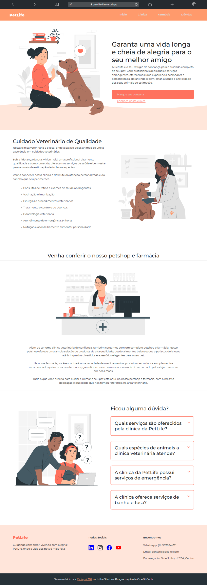

# 🐾 PetLife

Landing Page responsiva de uma clínica veterinária fictícia, desenvolvida com foco em design moderno, boa estruturação de conteúdo e acessibilidade para diferentes tamanhos de tela (desktop, tablet e mobile).

## 📋 Descrição

A **PetLife** é uma landing page que simula o site de uma clínica veterinária. Foi criada inicialmente para a versão desktop durante a formação Start da [OneBitCode](https://onebitcode.com/), mas posteriormente evoluída para uma versão 100% responsiva como um desafio pessoal.

A página apresenta as seções:
- Introdução e chamada para ação

- Serviços da clínica veterinária

- Petshop e farmácia

- Dúvidas frequentes

- Rodapé com informações de contato e redes sociais

## 🛠️ Tecnologias Utilizadas

- HTML5

- CSS3

- JavaScript

- Bootstrap 5

## 📱 Responsividade

O site foi otimizado para todos os tamanhos de tela, incluindo:
- Desktops
- Tablets
- Celulares

## 🚀 Deploy Online

Você pode acessar o projeto online por este link:

🔗 [pet-life-flax.vercel.app](https://pet-life-flax.vercel.app/)

## 📁 Acesse o Repositório

O código-fonte está disponível no GitHub:

🔗 [github.com/Bispo1307/PetLife](https://github.com/Bispo1307/PetLife)
